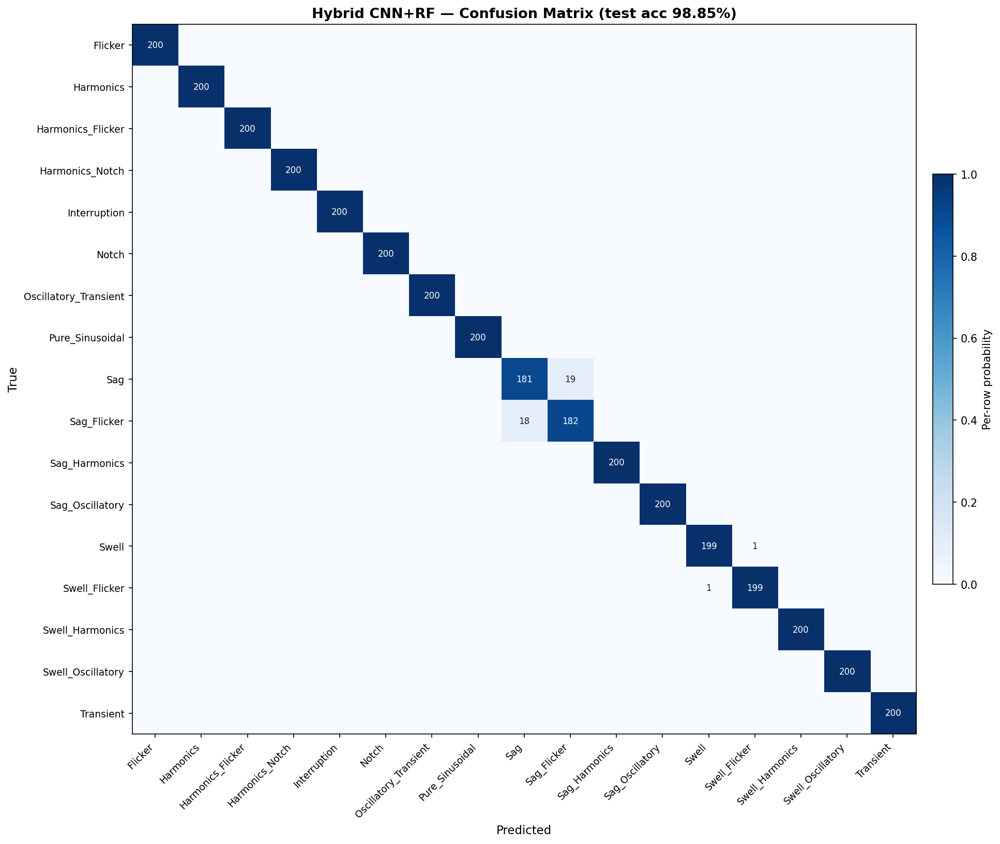

# Hybrid CNN+RF — Confusion Matrix & Per-Class Metrics

Generated from the deployed model in `backend/hybrid_rf.pkl` + `backend/hybrid_cnn_extractor.h5`. Same train/test split as the original training run (seed=42).

## Headline

- Test set size      : **3400** signals (200 per class)
- Overall accuracy   : **98.853%**
- Macro F1           : **98.853%**
- Macro precision    : 98.853%
- Macro recall       : 98.853%



## Per-class accuracy (sorted by recall)

| Class | Support | Correct | Recall | Precision |
|:------|--------:|--------:|-------:|----------:|
| Flicker | 200 | 200 | 100.00% | 100.00% |
| Harmonics | 200 | 200 | 100.00% | 100.00% |
| Harmonics_Flicker | 200 | 200 | 100.00% | 100.00% |
| Harmonics_Notch | 200 | 200 | 100.00% | 100.00% |
| Interruption | 200 | 200 | 100.00% | 100.00% |
| Notch | 200 | 200 | 100.00% | 100.00% |
| Oscillatory_Transient | 200 | 200 | 100.00% | 100.00% |
| Pure_Sinusoidal | 200 | 200 | 100.00% | 100.00% |
| Sag_Harmonics | 200 | 200 | 100.00% | 100.00% |
| Sag_Oscillatory | 200 | 200 | 100.00% | 100.00% |
| Swell_Harmonics | 200 | 200 | 100.00% | 100.00% |
| Swell_Oscillatory | 200 | 200 | 100.00% | 100.00% |
| Transient | 200 | 200 | 100.00% | 100.00% |
| Swell | 200 | 199 | 99.50% | 99.50% |
| Swell_Flicker | 200 | 199 | 99.50% | 99.50% |
| Sag_Flicker | 200 | 182 | 91.00% | 90.55% |
| Sag | 200 | 181 | 90.50% | 90.95% |

## Notable confusions (off-diagonal counts >= 2)

| True class | Predicted as | Count |
|:-----------|:-------------|------:|
| Sag | Sag_Flicker | 19 |
| Sag_Flicker | Sag | 18 |

## sklearn classification_report

```
                       precision    recall  f1-score   support

              Flicker     1.0000    1.0000    1.0000       200
            Harmonics     1.0000    1.0000    1.0000       200
    Harmonics_Flicker     1.0000    1.0000    1.0000       200
      Harmonics_Notch     1.0000    1.0000    1.0000       200
         Interruption     1.0000    1.0000    1.0000       200
                Notch     1.0000    1.0000    1.0000       200
Oscillatory_Transient     1.0000    1.0000    1.0000       200
      Pure_Sinusoidal     1.0000    1.0000    1.0000       200
                  Sag     0.9095    0.9050    0.9073       200
          Sag_Flicker     0.9055    0.9100    0.9077       200
        Sag_Harmonics     1.0000    1.0000    1.0000       200
      Sag_Oscillatory     1.0000    1.0000    1.0000       200
                Swell     0.9950    0.9950    0.9950       200
        Swell_Flicker     0.9950    0.9950    0.9950       200
      Swell_Harmonics     1.0000    1.0000    1.0000       200
    Swell_Oscillatory     1.0000    1.0000    1.0000       200
            Transient     1.0000    1.0000    1.0000       200

             accuracy                         0.9885      3400
            macro avg     0.9885    0.9885    0.9885      3400
         weighted avg     0.9885    0.9885    0.9885      3400

```
