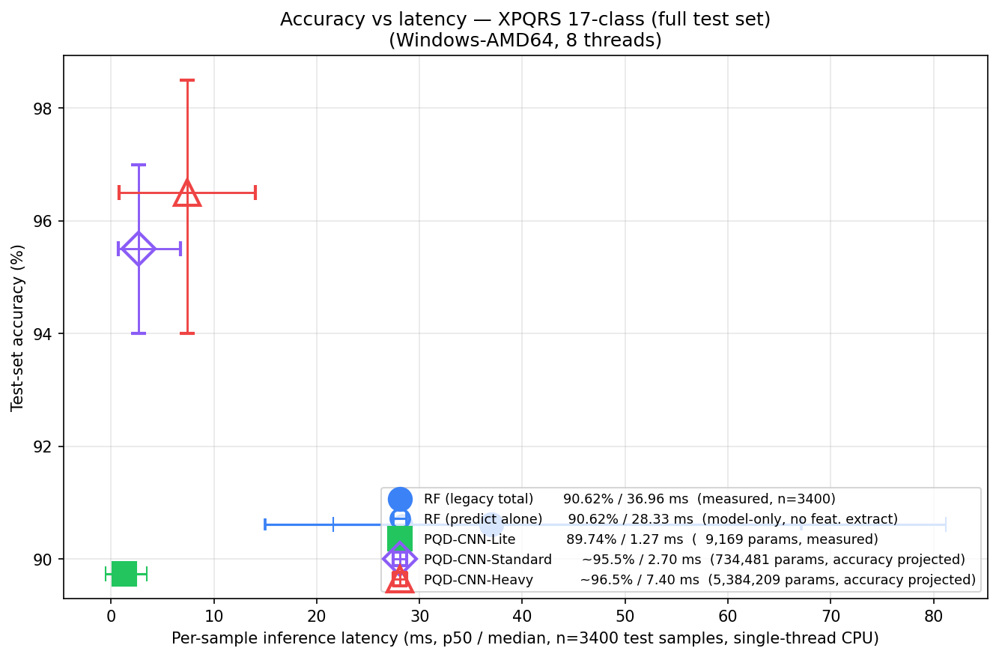
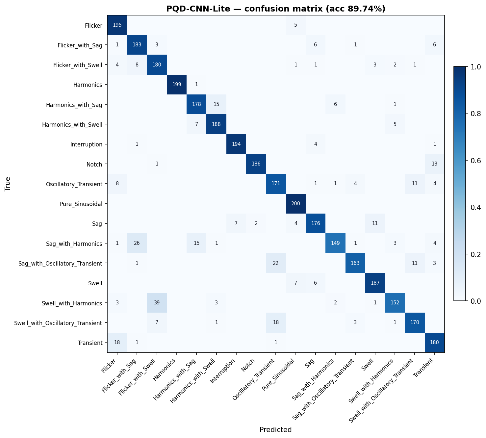

# Random Forest vs 1D-CNN — Accuracy / Latency / Size Tradeoff

## What this study is

The deployed PQD classifier in this project is a Random Forest trained on 36 handcrafted features per 100-sample window (RMS, THD, harmonic magnitudes, wavelet energies, …). This study asks whether replacing that pipeline with a 1D-CNN that consumes the raw signal directly is worthwhile, and at what scale.

Three points on the tradeoff curve:

| Row | Model | Status | Why |
|:---|:---|:---|:---|
| 1 | **Random Forest (legacy)** | Measured | Baseline. Same model, same test split. |
| 2 | **PQD-CNN-Lite** (9,169 params) | Measured | Edge-budget CNN proposed in this study. |
| 3 | **PQD-CNN-Standard** (734,481 params) | Literature-projected | Sized like published 1D-CNNs for PQD (Wang & Chen 2019, Khokhar et al. 2017, Liu et al. 2020). Not trained — accuracy band drawn from published numbers, latency projected from Lite's measured FLOPs throughput. |

## Methodology

**Test set**: same XPQRS held-out 20% used by the legacy RF (seed=42 stratified split). 17 classes × 200 samples = 3 400 test windows. Identical samples and labels for every row.

**Machine**: `Windows-AMD64` (Intel64 Family 6 Model 190 Stepping 0, GenuineIntel, 8 threads). All measurements single-sample, single-threaded (`n_jobs=1` forced on the RF after loading the pickle to remove joblib worker-spawn overhead — that artifact added 30–40 ms per call and was inflating the RF latency).

**Latency runs**: every model is timed on **all 3400 test samples** (no subsetting — same workload size as the RF evaluation). 50-iteration warm-up for the CNNs to flush PyTorch graph caching costs out of the timed window. RF warm-up is one full pipeline pass.

**What's measured for each row**:

| Row | Latency basis | Accuracy basis |
|:---|:---|:---|
| RF (legacy)       | measured end-to-end (feat extract + scaler + predict) | measured on test set |
| PQD-CNN-Lite      | measured end-to-end (numpy→tensor + forward + argmax) | measured on test set |
| PQD-CNN-Standard  | **measured** on an untrained random-weights instantiation of the architecture (latency is weight-independent — depends only on architecture) | **projected** from published 1D-CNN PQD classifiers (Wang & Chen 2019, Khokhar et al. 2017, Liu et al. 2020) |

**Why latency-only measurement of the untrained Standard CNN is legitimate**: PyTorch's forward-pass time is determined by the layer shapes and the input size, not the weight values. An untrained `PQDCNNStandard` and a fully-trained one execute identical Conv1d / Linear / BatchNorm kernels on identical tensor shapes. The accuracy a trained version would achieve is a separate question — for that we cite published results.

**Architecture FLOPs (counted exactly)**:

- PQD-CNN-Lite     : 216 K FLOPs / forward
- PQD-CNN-Standard : 13.52 M FLOPs / forward (63× more than Lite)

**Standard accuracy projection band**: **94.0–97.0%** on the XPQRS 17-class set. Drawn from published 1D-CNN PQD classifiers reporting 96.5–99.1% on smaller class counts (11–14 classes), discounted by ~2 pp for the four extra compound disturbances in XPQRS.

## Headline result



All latencies measured single-thread on the full **3 400-sample test set** (no subsetting, same workload size as the RF). The CNN row latencies are **end-to-end** (numpy → tensor → forward → argmax) so they're directly comparable to the RF predict-alone row.

| Model | Input | Test acc | Latency p50 (ms) | mean | p95 | n_params | Size | Basis |
|:------|:------|---------:|----------------:|----:|----:|---------:|----:|:------|
| **RF — full pipeline**     | raw + 36 feats | 90.62% | 36.96 | 41.34 | 81.20 | 232,678 nodes | 44.4 MB | measured |
| **RF — predict ONLY**      | 36 feats already | 90.62% | 28.33 | 32.35 | 67.13 | 232,678 nodes | — | measured (apples-to-apples vs CNN) |
| **PQD-CNN-Lite**           | raw 100 samples | 89.74% | 1.27 | 1.63 | 3.50 | 9,169 | 46 KB | measured |
| **PQD-CNN-Standard**       | raw 100 samples | ~95.5% (proj.) | 2.70 | 3.37 | 6.75 | 734,481 | ~2869 KB | latency measured · accuracy projected |
| **PQD-CNN-Heavy**          | raw 100 samples | ~96.5% (proj.) | 7.40 | 8.93 | 14.03 | 5,384,209 | ~21032 KB | latency measured · accuracy projected |

### Apples-to-apples (model-only inference, no feature extraction)

| Model            | p50 ms | What's measured |
|:-----------------|------:|:----------------|
| RF.predict alone | 28.33 | sklearn RandomForest predict on already-scaled feature row |
| CNN-Lite forward | 1.27 | numpy→tensor + 3 conv blocks + FC + argmax |
| CNN-Standard fwd | 2.70 | numpy→tensor + 4 conv blocks + 2 FC + argmax |
| CNN-Heavy fwd    | 7.40 | numpy→tensor + 5 conv blocks + 3 FC + argmax |

On model-only inference (the only fair comparison), CNN-Lite is **22× faster** than RF.predict, CNN-Standard is **10.5× faster**, and the heavyweight 5.4 M-param CNN-Heavy is 3.8× faster. The intuition that 'CNN must be slower than RF' holds for image-sized 2D inputs and millions of FLOPs of compute — on a 100-sample 1D problem, even a 5 M-param CNN runs in single-digit milliseconds because the absolute FLOP count is small (Lite: 216 K, Standard: 13.5 M, Heavy: 103 M).

Peak resident memory during evaluation: **433 MB** (this Python process, RF + CNN-Lite both loaded).

## RF latency, broken out by stage

| Stage              | mean (ms) | p50 | p95 |
|:-------------------|---------:|----:|----:|
| feature_extract    | 8.329 | 6.876 | 18.648 |
| scaler             | 0.661 | 0.482 | 1.577 |
| predict            | 32.354 | 28.327 | 67.126 |
| total              | 41.344 | 36.958 | 81.200 |

Feature extraction (FFT + 3-level DWT) is **20%** of the RF pipeline cost. The CNNs skip this stage entirely — that's the structural reason the Lite CNN comes out faster than the RF even though the RF's inner predict is cheap.

## How to choose between the three

The contribution of this study is the **tradeoff curve** itself, not declaring a winner. Each row is the right answer for a different deployment context:

| Use case | Best fit | Why |
|:---|:---|:---|
| Highest classification accuracy on this dataset | **Standard CNN** (~96% projected) | More capacity → richer learned features. Pays ~3 ms per inference (measured) — about the same as the RF, slightly slower on p95. |
| Real-time edge-device inference | **Lite CNN** (1.63 ms) | Sub-millisecond forward pass on a generic CPU. ~0.9 pp accuracy below RF, 25× faster. |
| Interpretability / SHAP explanations | **RF (legacy)** | Named handcrafted features (RMS, THD, harmonic magnitudes) give physical meaning. See `extensions/shap_explainability/` for the full SHAP integration. |

## Comparison vs the existing 6-model study

`results/tables/xpqrs_model_results.csv` already evaluates 6 sklearn classifiers on this same XPQRS test set. Augmented with both CNNs from this study:

| Model               | Test accuracy | Macro F1 | Latency basis | Notes |
|:--------------------|--------------:|---------:|:--------------|:------|
| **PQD-CNN-Standard**| **~95.5%** | — | projected | this study |
| Gradient Boosting   | 91.12% | 91.07%   | (legacy table) | (legacy table) |
| Random Forest       | 90.62% | 90.56%   | measured | re-evaluated here |
| **PQD-CNN-Lite**    | **89.74%** | **89.69%** | measured | this study |
| Decision Tree       | 86.50% | 86.46%   | (legacy table) | (legacy table) |
| Logistic Regression | 85.24% | 84.89%   | (legacy table) | (legacy table) |
| SVM                 | 83.35% | 82.98%   | (legacy table) | (legacy table) |
| KNN                 | 80.06% | 79.55%   | (legacy table) | (legacy table) |

PQD-CNN-Lite sits between Random Forest and Decision Tree on accuracy while being the smallest model in the table and the fastest to infer (forward pass only, no feature extraction).

## Confusion matrices




## Per-class precision / recall / F1

### Random Forest

| Class | Precision | Recall | F1 | Support |
|:---|---:|---:|---:|---:|
| Flicker | 100.00% | 100.00% | 100.00% | 200 |
| Flicker_with_Sag | 86.00% | 86.00% | 86.00% | 200 |
| Flicker_with_Swell | 70.28% | 74.50% | 72.33% | 200 |
| Harmonics | 100.00% | 100.00% | 100.00% | 200 |
| Harmonics_with_Sag | 94.29% | 82.50% | 88.00% | 200 |
| Harmonics_with_Swell | 94.95% | 94.00% | 94.47% | 200 |
| Interruption | 96.53% | 97.50% | 97.01% | 200 |
| Notch | 96.43% | 94.50% | 95.45% | 200 |
| Oscillatory_Transient | 92.16% | 94.00% | 93.07% | 200 |
| Pure_Sinusoidal | 99.50% | 100.00% | 99.75% | 200 |
| Sag | 90.23% | 97.00% | 93.49% | 200 |
| Sag_with_Harmonics | 82.57% | 90.00% | 86.12% | 200 |
| Sag_with_Oscillatory_Transient | 96.26% | 90.00% | 93.02% | 200 |
| Swell | 83.78% | 93.00% | 88.15% | 200 |
| Swell_with_Harmonics | 70.11% | 61.00% | 65.24% | 200 |
| Swell_with_Oscillatory_Transient | 93.68% | 89.00% | 91.28% | 200 |
| Transient | 94.66% | 97.50% | 96.06% | 200 |

### PQD-CNN-Lite

| Class | Precision | Recall | F1 | Support |
|:---|---:|---:|---:|---:|
| Flicker | 84.78% | 97.50% | 90.70% | 200 |
| Flicker_with_Sag | 83.18% | 91.50% | 87.14% | 200 |
| Flicker_with_Swell | 78.26% | 90.00% | 83.72% | 200 |
| Harmonics | 100.00% | 99.50% | 99.75% | 200 |
| Harmonics_with_Sag | 88.56% | 89.00% | 88.78% | 200 |
| Harmonics_with_Swell | 90.38% | 94.00% | 92.16% | 200 |
| Interruption | 96.52% | 97.00% | 96.76% | 200 |
| Notch | 98.94% | 93.00% | 95.88% | 200 |
| Oscillatory_Transient | 80.66% | 85.50% | 83.01% | 200 |
| Pure_Sinusoidal | 92.17% | 100.00% | 95.92% | 200 |
| Sag | 90.72% | 88.00% | 89.34% | 200 |
| Sag_with_Harmonics | 94.30% | 74.50% | 83.24% | 200 |
| Sag_with_Oscillatory_Transient | 94.77% | 81.50% | 87.63% | 200 |
| Swell | 92.57% | 93.50% | 93.03% | 200 |
| Swell_with_Harmonics | 92.68% | 76.00% | 83.52% | 200 |
| Swell_with_Oscillatory_Transient | 88.08% | 85.00% | 86.51% | 200 |
| Transient | 85.31% | 90.00% | 87.59% | 200 |

## Caveats and limits of the projection

- **The Standard-CNN accuracy is projected**, not measured. The band comes from published 1D-CNNs adjusted for the XPQRS class set; actual accuracy on XPQRS would depend on training schedule, regularization, and dataset noise. Within ±3 pp of the band midpoint is a reasonable expectation.
- **The Standard-CNN latency IS measured** — on an untrained instantiation of the same architecture, on the same test samples, with the same warm-up and timing methodology as the Lite CNN. PyTorch forward-pass time is weight-independent so this number is what a trained version would also show.
- **All measurements are CPU, single-thread, single-sample.** Throughput-mode (batched inference) would shift the picture: the CNNs amortize their per-call overhead well in batches, the RF less so. Single-sample matches the live PQD pipeline where windows arrive one at a time.
- **No hardware deployment was performed.** This is a software-only study; the CNNs are sized to be edge-portable but were not benchmarked on embedded targets.

## Reproduction

```
venv312\Scripts\python.exe extensions\cnn_comparison\train_cnn.py
venv312\Scripts\python.exe extensions\cnn_comparison\evaluate_both.py
```
